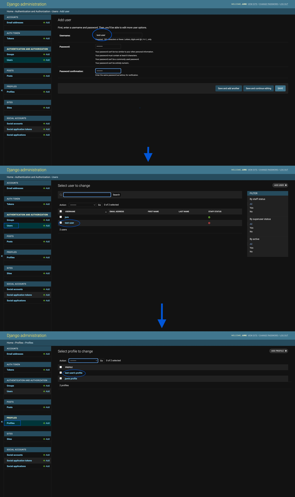
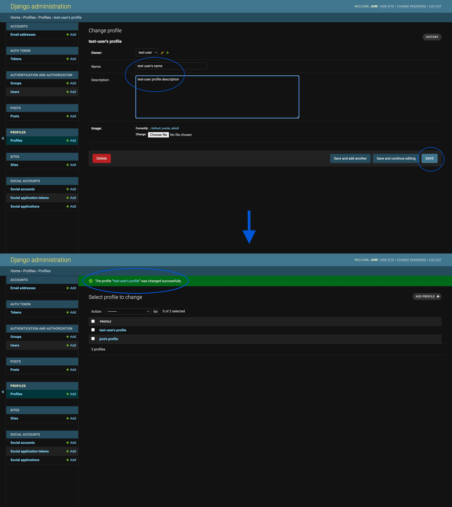
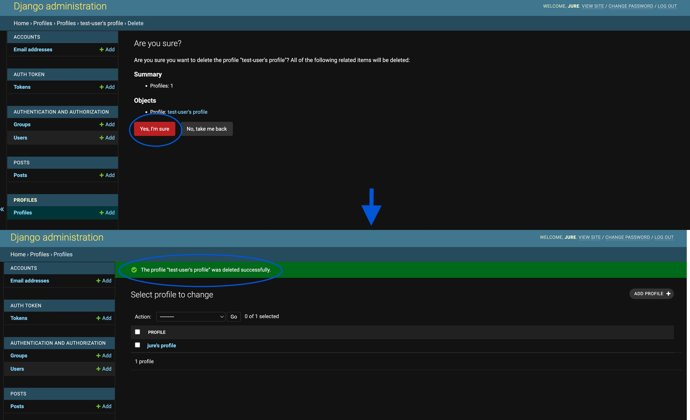

# Harmonize - Django REST Framework API

# Overview

This repository serves as Harmonize App Backend REST API. The purpose is to provide data to be used in Front-End design with [React. js](https://reactjs.org/). For the main projects documentation refer to [Harmonize](https://github.com/JureSeselj/harmonize-drf-api) project.
The API endpoint can be found [here](https://harmonize-drf-api.herokuapp.com/)

## Table of Contents
  - [Overview](#overview)
  - [User Stories](#user-stories)
  - [Database](#database)
    - [User Model](#user-model)
    - [Profile Model](#profile-model)
    - [Post Model](#post-model)
    - [Follower Model](#follower-model)
    - [Comment Model](#comment-model)
    - [Like Model](#like-model)
  - [Technologies Used](#technologies-used)
    - [Languages & Frameworks](#languages--frameworks)
    - [Libraries & Tools](#libraries--tools)
  - [Validation](#validation)
    - [PEP8 Validation](#pep8-validation)
  - [Testing](#testing)
    - [Manual testing of user stories](#manual-testing-of-user-stories)
    - [Automated testing](#automated-testing)
  - [Credits](#credits)
    - [Content](#content)
    - [Information Sources / Resources](#information-sources--resources)

## User Stories - UX

The back-end section of the project focuses on its administration side and covers one user story:
- As an admin, I want to be able to create, edit and delete the users, posts, comments and likes, so that I can have a control over the content of the application and remove any potential inappropriate content.

## Database

The following models were created to represent the database model structure of the application:


#### User Model

- The User model contains information about the user. It is part of the Django allauth library.
- One-to-one relation with the Profile model owner field
- ForeignKey relation with the Follower model owner and followed fields
- ForeignKey relation with the Post model owner field
- ForeignKey relation with the Comment model owner field
- ForeignKey relation with the Like model owner field

#### Profile Model

- The Profile model contains the following fields: owner, name, description, created_on, updated_on and image
- One-to-one relation between the owner field and the User model id field

#### Post Model

- The Post model contains the following fields: owner, created_on, updated_on, title, description, category and image
- ForeignKey relation with the Comment model post field
- ForeignKey relation with the Like model post field

#### Follower Model

- The Follower model contains the following fields: owner, followed and created_on
- ForeignKey relation between the owner field and the User model id field
- ForeignKey relation between the followed field and the User model post field

#### Comment Model

- The Comment model contains the following fields: owner, post, created_on, updated_on and content
- ForeignKey relation between the owner field and the User model id field
- ForeignKey relation between the post field and the User model post field

#### Like Model

- The Like model contains the following fields: owner, post and created_on
- ForeignKey relation between to the User model id field
- ForeignKey relation between the owner field and the User model id field
- ForeignKey relation between the post field and the Post model post field

[Back to Top](#table-of-contents)

## Technologies Used

### Languages & Frameworks

- Python
- Django

### Libraries & Tools

- [GitHub](https://github.com/) was used as a remote repository to store project code
- [Gitpod)](https://gitpod.io/workspaces) - a virtual IDE workspace used to build this site
- [APITestCase](https://www.django-rest-framework.org/api-guide/testing/) - Django Rest Framework APITestCase was used for automated testing
- [Cloudinary](https://cloudinary.com/) to store static files
- [Coverage](https://coverage.readthedocs.io/en/6.4.4/) used to produce automated testing report
- [Dbdiagram.io](https://dbdiagram.io/home) used for the database schema diagram
- [Git](https://git-scm.com/) was used for version control via Gitpod terminal to push the code to GitHub
- [Django REST Framework](https://www.django-rest-framework.org/) was used to build the back-end API
- [Django AllAuth](https://django-allauth.readthedocs.io/en/latest/index.html) was used for user authentication
- [Pillow](https://pillow.readthedocs.io/en/stable/) was used for image processing and validation
- [Psycopg2](https://www.psycopg.org/docs/) was used as a ElephantSQL database adapter for Python
- [Heroku](https://heroku.com) was used to deploy the project into live environment
- [ElephantSQL](https://www.elephantsql.com/) – deployed project on Heroku uses a ElephantSQL database

## Validation

### PEP8 Validation

All code was formatted using [autopep8](https://pypi.org/project/autopep8/).
Additionally, manual validation was done with [PEP8 online](http://pep8online.com).

The only code which was left with long-line prompts is `settings.py` for code functionality.


## Testing

The following tests were carried out on the app:
1. Manual testing of user stories
2. Automated testing

### Manual testing of user stories

- As an admin, I want to be able to create, edit and delete the users, posts, comments and likes, so that I can have a control over the content of the application and remove any potential inappropriate content

**Test** | **Action** | **Expected Result** | **Actual Result**
-------- | ------------------- | ------------------- | -----------------
User | Create, update & delete user | A user can be created, edited or deleted | Works as expected
User | Change permissions | User permissions can be updated | Works as expected
Profile | Create, update & delete | User profile can be created, edited or deleted | Works as expected
Post | Create, update & delete | A post can be created, edited or deleted | Works as expected
Comment | Create, update & delete | A comment can be created, edited or deleted | Works as expected
Like | Create & delete | A like can be created or deleted (like / unlike post) | Works as expected
Follower | Create & delete | Follow or unfollow user | Works as expected

In addition, posts, comments, likes and following can be created by logged-in users only. Users can only update or delete the content which was created by themselves.

#### USER
  <details><summary>Create user</summary>
    
  </details>
  <details><summary>Change user permissions</summary>
    
  </details>

---

#### PROFILE
  <details><summary>Update profile</summary>
    
  </details>
        <details><summary>Delete profile</summary>
    
  </details>

---

#### POST
  <details><summary>Create post</summary>
    
  </details>
  <details><summary>Update post</summary>
    
  </details>
  <details><summary>Delete post</summary>
    
  </details>

---

#### COMMENT
  <details><summary>Create comment</summary>
    
  </details>
  <details><summary>Update comment</summary>
    
  </details>
  <details><summary>Delete comment</summary>
    
  </details>

---

#### LIKE
  <details><summary>Create like - like post</summary>
    
  </details>
  <details><summary>Delete like - unlike post</summary>
    
  </details>

---

#### FOLLOWER
  <details><summary>Create - Follow user</summary>
    
  </details>
  <details><summary>Delete - Unfollow user</summary>
    
  </details>

---

### Automated testing

Automated testing was done using the Django Rest Framework APITestCase (a very similar to Django's TestCase). The report of overall testing was produced using the coverage tool (```$ coverage report``` & ```$ coverage html``` commands)

- Tests summary


<details><summary>Detailed coverage report</summary>

</details>

## Credits

### Content

* Project setup is based on [Code Institute](https://codeinstitute.net) tutorial video Django REST Framework.
* The Comment app is copied from [Code Institute](https://codeinstitute.net) tutorial Django REST Framework and adjusted as needed.
* Email confirmation functionality inspired from [Stack Overflow](https://stackoverflow.com/questions/24809505/django-allauth-how-to-properly-use-email-confirmed-signal-to-set-user-to-active).
* Deployment section is based on the owner's previous project [TastyBlog](https://github.com/JureSeselj/tasty_blog).

### Information Sources / Resources

* [Code Institute](https://codeinstitute.net/ie/)
* [Free Code Camp](https://www.freecodecamp.org/learn)
* [W3Schools - Python](https://www.w3schools.com/python/)
* [Stack Overflow](https://stackoverflow.com/)

[Back to Top](#table-of-contents)

---

**<div align='center'>Copyright @ Jure Seselj 2023</div>**
<div align='center'>
    <a href="https://www.linkedin.com/in/jure-seselj-062654192/" target="_blank">
        
    </a>
</div>